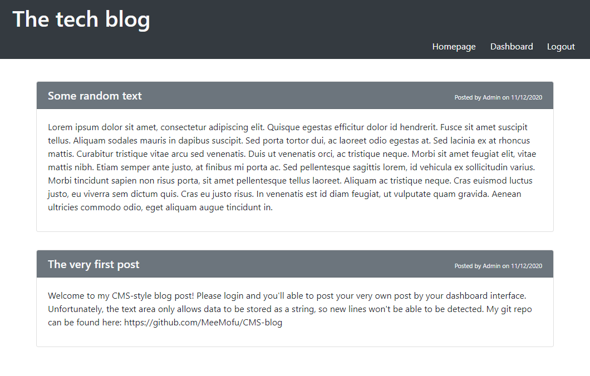

# CMS-blog

Deployed application: https://radiant-citadel-50156.herokuapp.com/

## Description

This is a CMS-style blog website. This web-app has full backend database hosted on Heroku. Users can create new accounts and create new post

This application ulilized [express](https://www.npmjs.com/package/express) to create the API server with [express-session](https://www.npmjs.com/package/express-session) and [express-handelbars](https://www.npmjs.com/package/express-handlebars), as well as [sequelize](https://www.npmjs.com/package/sequelize) to interact with SQL database. Currently the program is running on MySQL dialect. The [connect-session-sequelize](https://www.npmjs.com/package/connect-session-sequelize) package is used to store the cookie session.

**Warning: This blog does not have content check, so it's advised to not follow any random link. You have been warned.**

## Installation

In case you want to have it run on your local machine, it's required to have [node.js](https://nodejs.org/en/download/) and [mySQL](https://www.mysql.com/downloads/) installed.

Once you have cloned the files, run the install command in the terminal:
 
    npm install

Next, you'll need to create a .env enviroment file in your root directory with the following information:

    DB_NAME='cms_blog_db'
    DB_USER='root'
    DB_PW= <your MySQL password>
    CK_SECRET=<your cookie secret>

With that, your program is ready to go, just start the server with:

    npm start

The website will now be available on http://localhost:3001/